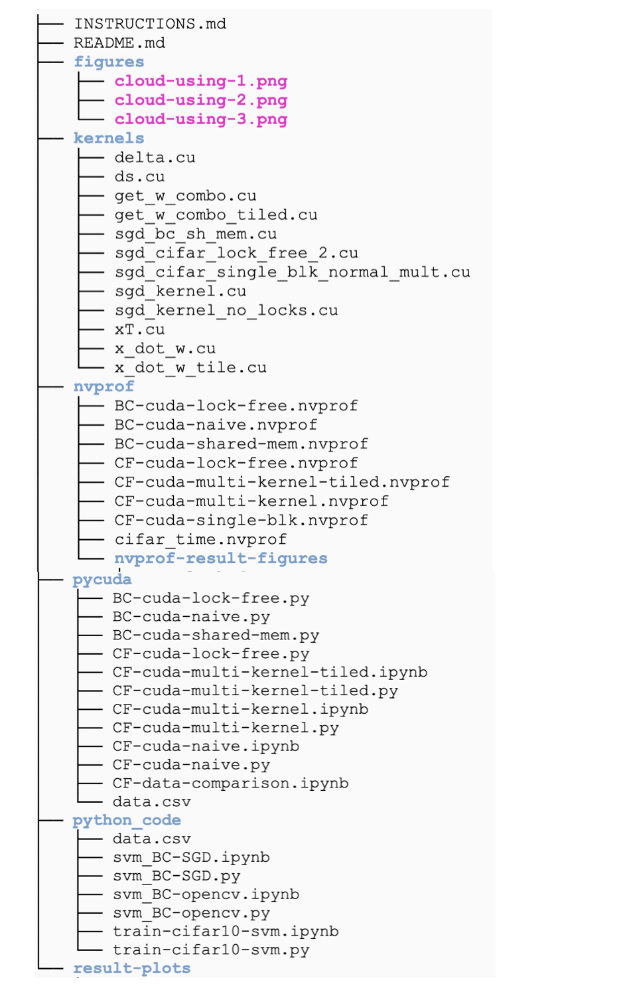

# Acceleration of SVM Algorithm on GPU using PyCuda 
Authors: \
Pratyush Agrawal, pa2562 \
Pei Liu, pl2748
## Directory Organization

Our repository has the following structure. It has 6 subdirectories at the top level. 

### Directory 1: python_code/

This directory contains four files:

1.) data.csv\
This is the Breast cancer dataset, which will be read by all .py files whose name containing "BC"

2.) svm_BC-SGD.py\
A python code implementing SVM by using SGD on BC dataset
  
3.) svm_BC-opencv.py\
OpenCV library implementation of svm on BC dataset

4.) train-cifar10-svm.py\ 
 Python implementation of sgd on cifar 10 dataset

### Directory 2: pycuda/

These are PyCuda source code which implement different kernels\
Three pycuda code for BC dataset

1.) BC-cuda-lock-free.py\
2.) BC-cuda-naive.py\
3.) BC-cuda-shared-mem.py

Four pycuda code for Cifar-10 dataset

4.) CF-cuda-naive.py\
5.) CF-cuda-lock-free.py\
6.) CF-cuda-multi-kernel.py\
7.) CF-cuda-multi-kernel-tiled.py

We also have three corresponding jupyter notebooks for four Cifar-10 pycuda code excluding CF-cuda-lock-free. These three notebooks will generate figures for time and accuracy with different max_epochs, while .py files only run for one fix max_epoch.

CF-data-comparison.ipynb is to generate figures shown in our report.

### Directory 3: kernels/ 

This diectory contains the cuda kernels to be executed on GPU for Breast-Cancer and CiFAR-10 dataset.\
1.) sgd_kerne.cu \
    This kernel is used by BC-cuda-naive.py program. It performs the sgd on BC dataset where each thread works on one feature of the datapoint.
    
2.) sgd_bc_sh_mem.cu \
This kernel is used by BC-cuda-shared-mem.py program. It performs the sgd on BC dataset where each thread works on one feature of the datapoint. This kernel also used the shared memory and tiled approach where a batch of data points are first loaded into shared memory and then computed upon.

3.) sgd_kernel_no_locks.cu\
  This kernel is used by BC-cuda-no-lock.py program. It performs the sgd on BC dataset where each thread works on one datapoint. So in a lock free manner all the datapoints will be updating the weights in every epoch.

4.) sgd_cifar_single_blk_normal_mult.cu\
This kernel is used by CF-cuda-naive.py program. It is to implement SVM on cifar dataset, which includes tiled multiplication and use of shared memory to perform computation, each thread works on each class.

5.) sgd_cifar_lock_free_2.cu\
This is the kernel code used to implement SVM on cifar dataset, each thread works on one datapoint and they update the weights in alock free manner for every epoch.

6.) x_dot_w.cu, xT.cu, ds.cu, delta.cu, get_w_combo.cu \
  These 5 kernels work for the CF-cuda-multi-kernel.py pycuda Program.
  
7.) x_dot_w_tile.cu, xT.cu, ds.cu, delta.cu, get_w_combo_tiled.cu \
  These 5 kernels work for the CF-cuda-multi-kernel-tiled.py pycuda Program.

### Directory 4: nvprof/

This folder contains all the nvprof files for each pycuda program. Snap-shots of profiling are stored in nvprof-result-figures/

### Directory 5: results-plots/
This folder contains all the figures we generate to show running time and accuracies. Some are put inside the report. Some are not.

### Directory 6: figures/

This folder contains three images which show that we have been using google cloud for this project.

## Commands

Run commands in pycuda/ folder and python_code/ folder.\
To run programs in pycuda folder, you need to activate your cuda environment first.\
If we have a jupyter notebook for a pycuda program, you can run it by command:\
> jupyter notebook CF-cuda-multi-kernel-tiled.ipynb

If we have only python code for a pycuda program, you can run it by command:\
> python CF-cuda-multi-kernel-tiled.py

To run programs in python_code folder, you use command:\
> python train-cifar10-svm.py

Commands to reading the profiling result:\
In nvprof/ folder, 
> viewprofile CF-cuda-multi-kernel-tiled.nvprof

